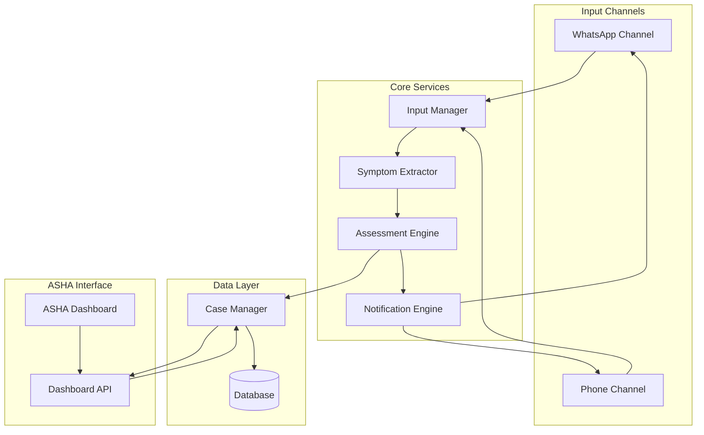

# Design Document: Health Risk Assessment System

## Overview

The Health Risk Assessment System is a multi-channel health triage platform that enables users to report symptoms via WhatsApp or phone calls, receives AI-powered risk assessments, and allows ASHA workers to track and manage patient cases. The system classifies health risks into three levels (Home Care, PHC Visit, Emergency) and prioritizes cases for healthcare worker intervention.

The architecture follows a microservices pattern with clear separation between input channels (WhatsApp, Phone), the AI assessment engine, case management, and the ASHA worker dashboard. This design ensures scalability, maintainability, and the ability to add new communication channels in the future.

## Architecture

### High-Level Architecture



### Component Responsibilities

- **Input Manager**: Routes incoming messages/calls to appropriate processors, maintains session state
- **Symptom Extractor**: Parses natural language input and structures symptom data
- **Assessment Engine**: Applies medical rules and ML models to classify risk levels
- **Case Manager**: Creates, stores, and retrieves case records
- **Notification Engine**: Delivers assessment results through appropriate channels
- **Dashboard API**: Provides ASHA workers with case data and management capabilities

## Components and Interfaces

### 1. Input Manager

**Purpose**: Unified entry point for all user interactions, managing sessions across channels.

**Interface**:
```
InputManager:
  receiveWhatsAppMessage(userId: String, messageText: String, timestamp: DateTime) -> SessionId
  receivePhoneCall(phoneNumber: String, audioStream: AudioStream) -> SessionId
  getSession(sessionId: SessionId) -> Session
  updateSession(sessionId: SessionId, data: SymptomData) -> Result
```

**Behavior**:
- Creates or retrieves user session on each interaction
- Maintains conversation context for multi-turn interactions
- Routes to Symptom Extractor when input is received
- Handles timeouts and session cleanup

### 2. Symptom Extractor

**Purpose**: Converts unstructured user input (text or voice) into structured symptom data.

**Interface**:
```
SymptomExtractor:
  extractFromText(messageText: String, context: SessionContext) -> ExtractionResult
  extractFromAudio(audioStream: AudioStream) -> ExtractionResult
  isComplete(symptomData: SymptomData) -> Boolean
  generateClarificationQuestion(symptomData: SymptomData) -> String
```

**Behavior**:
- Uses NLP to identify symptoms, duration, severity from text
- Integrates speech-to-text for phone channel
- Identifies missing critical information
- Generates contextual follow-up questions
- Validates extracted data completeness

### 3. Assessment Engine

**Purpose**: Evaluates symptom data and classifies health risk level using medical rules and ML models.

**Interface**:
```
AssessmentEngine:
  assessRisk(symptomData: SymptomData) -> Assessment
  getRiskLevel(assessment: Assessment) -> RiskLevel
  getRecommendations(riskLevel: RiskLevel) -> Recommendations
```

**Data Types**:
```
RiskLevel = HOME_CARE | PHC_VISIT | EMERGENCY

Assessment:
  riskLevel: RiskLevel
  confidence: Float (0.0 to 1.0)
  contributingFactors: List<String>
  timestamp: DateTime

Recommendations:
  actions: List<String>
  contacts: List<ContactInfo>
  timeframe: String
```

**Behavior**:
- Applies rule-based triage for critical symptoms (chest pain, difficulty breathing, severe bleeding)
- Uses ML model for complex symptom combinations
- Generates confidence scores for classifications
- Provides explainable factors contributing to risk level
- Defaults to higher risk level when confidence is low

**Risk Classification Logic**:
- **Emergency**: Life-threatening symptoms (severe chest pain, unconsciousness, severe bleeding, difficulty breathing)
- **PHC Visit**: Moderate symptoms requiring medical evaluation (persistent fever, moderate pain, infection signs)
- **Home Care**: Mild symptoms manageable at home (minor cold, mild headache, minor cuts)

### 4. Case Manager

**Purpose**: Manages the lifecycle of patient cases from creation to resolution.

**Interface**:
```
CaseManager:
  createCase(userId: String, assessment: Assessment, symptomData: SymptomData) -> Case
  getCase(caseId: CaseId) -> Case
  getCasesByUser(userId: String) -> List<Case>
  getCasesByRiskLevel(riskLevel: RiskLevel) -> List<Case>
  getAllCases(filters: CaseFilters) -> List<Case>
  updateCaseStatus(caseId: CaseId, status: CaseStatus, ashaId: String, notes: String) -> Result
  addFollowUp(caseId: CaseId, followUp: FollowUp) -> Result
```

**Behavior**:
- Creates unique case identifiers
- Links multiple assessments to same user
- Maintains case history and status transitions
- Enforces data retention and privacy policies
- Provides efficient querying for dashboard

### 5. Notification Engine

**Purpose**: Delivers assessment results to users through their original communication channel.

**Interface**:
```
NotificationEngine:
  sendWhatsAppMessage(userId: String, message: String) -> Result
  sendSMS(phoneNumber: String, message: String) -> Result
  makeCallback(phoneNumber: String, message: String) -> Result
  formatAssessmentMessage(assessment: Assessment, recommendations: Recommendations) -> String
```

**Behavior**:
- Routes notifications to correct channel based on session
- Formats messages in user-friendly, non-technical language
- Includes risk level, actions, and contact information
- Handles delivery failures with retry logic
- Logs all notification attempts

### 6. Dashboard API

**Purpose**: Provides ASHA workers with case management and tracking capabilities.

**Interface**:
```
DashboardAPI:
  authenticate(credentials: Credentials) -> AuthToken
  getCases(authToken: AuthToken, filters: CaseFilters) -> List<CaseView>
  getCaseDetails(authToken: AuthToken, caseId: CaseId) -> CaseDetails
  updateCase(authToken: AuthToken, caseId: CaseId, update: CaseUpdate) -> Result
  setFollowUpReminder(authToken: AuthToken, caseId: CaseId, reminderTime: DateTime) -> Result
  getReminders(authToken: AuthToken) -> List<Reminder>
```

**Behavior**:
- Authenticates ASHA workers
- Provides filtered, sorted case lists
- Supports real-time updates via WebSocket
- Logs all access for audit trail
- Enforces role-based access control

## Data Models

### User
```
User:
  userId: String (unique identifier)
  phoneNumber: String
  whatsappId: String (optional)
  name: String (optional)
  createdAt: DateTime
  lastContactAt: DateTime
```

### Session
```
Session:
  sessionId: String
  userId: String
  channel: Channel (WHATSAPP | PHONE)
  symptomData: SymptomData
  conversationHistory: List<Message>
  status: SessionStatus (ACTIVE | COMPLETE | EXPIRED)
  createdAt: DateTime
  expiresAt: DateTime
```

### SymptomData
```
SymptomData:
  symptoms: List<Symptom>
  duration: Duration
  severity: Severity (MILD | MODERATE | SEVERE)
  additionalInfo: Map<String, String>
  isComplete: Boolean

Symptom:
  name: String
  bodyPart: String (optional)
  onset: String
  characteristics: List<String>
```

### Case
```
Case:
  caseId: String (unique identifier)
  userId: String
  symptomData: SymptomData
  assessment: Assessment
  riskLevel: RiskLevel
  status: CaseStatus (NEW | CONTACTED | IN_PROGRESS | RESOLVED)
  assignedAshaId: String (optional)
  followUps: List<FollowUp>
  createdAt: DateTime
  updatedAt: DateTime

FollowUp:
  ashaId: String
  notes: String
  action: String
  timestamp: DateTime
  reminderTime: DateTime (optional)

CaseStatus = NEW | CONTACTED | IN_PROGRESS | RESOLVED
```

### CaseView (Dashboard)
```
CaseView:
  caseId: String
  userContact: String
  riskLevel: RiskLevel
  primarySymptoms: List<String>
  status: CaseStatus
  priority: Integer
  createdAt: DateTime
  lastUpdated: DateTime
```

## Correctness Properties

*A property is a characteristic or behavior that should hold true across all valid executions of a system—essentially, a formal statement about what the system should do. Properties serve as the bridge between human-readable specifications and machine-verifiable correctness guarantees.*


### Property 1: Message Storage Persistence
*For any* WhatsApp message sent to the system, the message content should be stored and retrievable from the database.
**Validates: Requirements 1.1**

### Property 2: Symptom Extraction Completeness
*For any* text message containing symptom information, the symptom extractor should produce structured SymptomData with at least one symptom identified.
**Validates: Requirements 1.2**

### Property 3: Acknowledgment Timeliness
*For any* completed symptom extraction, the system should send an acknowledgment to the user within 30 seconds.
**Validates: Requirements 1.3**

### Property 4: Clarification Request for Incomplete Data
*For any* message that results in incomplete SymptomData (isComplete = false), the system should generate and send a clarification question to the user.
**Validates: Requirements 1.4**

### Property 5: Multi-Message Session Accumulation
*For any* user session, sending multiple messages should accumulate symptoms in the same SymptomData object, with each message adding to the conversation history.
**Validates: Requirements 1.5**

### Property 6: Voice Data Extraction
*For any* audio stream containing symptom descriptions, the system should extract structured SymptomData with identifiable symptoms.
**Validates: Requirements 2.2**

### Property 7: Voice Recognition Error Handling
*For any* audio input that fails voice recognition (confidence below threshold), the system should request clarification from the user.
**Validates: Requirements 2.3**

### Property 8: Call Completion Data Validation
*For any* completed phone call session, the resulting SymptomData should have isComplete = true before triggering assessment.
**Validates: Requirements 2.4**

### Property 9: Voice Processing Timeliness
*For any* phone call, the conversion from audio to structured SymptomData should complete within 60 seconds of call end.
**Validates: Requirements 2.5**

### Property 10: Assessment Timeliness
*For any* complete SymptomData, the assessment engine should produce an Assessment within 2 minutes.
**Validates: Requirements 3.1**

### Property 11: Single Risk Level Classification
*For any* Assessment, exactly one RiskLevel should be assigned (HOME_CARE, PHC_VISIT, or EMERGENCY), with no null or multiple values.
**Validates: Requirements 3.2**

### Property 12: Risk-Appropriate Recommendations
*For any* Assessment, the Recommendations should include appropriate content based on RiskLevel: home care actions for HOME_CARE, PHC location and timeframe for PHC_VISIT, and emergency contacts and urgent guidance for EMERGENCY.
**Validates: Requirements 3.3, 3.4, 3.5**

### Property 13: Result Delivery Timeliness
*For any* completed Assessment, the notification should be sent to the user within 30 seconds of assessment completion.
**Validates: Requirements 4.1**

### Property 14: Channel-Matched Notification Routing
*For any* user session, the notification channel should match the input channel: WhatsApp sessions receive WhatsApp messages, phone sessions receive SMS or callback.
**Validates: Requirements 4.2, 4.3**

### Property 15: Notification Message Completeness
*For any* notification message, it should contain the RiskLevel, recommended actions list, and relevant contact information.
**Validates: Requirements 4.4**

### Property 16: Assessment-to-Case Creation
*For any* completed Assessment, a Case record should be created with a unique caseId.
**Validates: Requirements 5.1**

### Property 17: Case Data Completeness
*For any* Case, it should contain all required fields: user contact information, SymptomData, RiskLevel, assessment timestamp, and recommended actions.
**Validates: Requirements 5.2**

### Property 18: Case ID Uniqueness
*For any* two Cases in the system, their caseId values should be distinct (no duplicates).
**Validates: Requirements 5.3**

### Property 19: User Linking Across Assessments
*For any* user who submits multiple assessments, all resulting Cases should reference the same userId.
**Validates: Requirements 5.5**

### Property 20: Case Organization by Risk Level
*For any* list of Cases returned by the dashboard, Emergency cases should appear before PHC_Visit cases, which should appear before Home_Care cases.
**Validates: Requirements 6.2**

### Property 21: Case View Data Completeness
*For any* CaseView displayed in the dashboard, it should include user contact, symptoms, risk level, and assessment time.
**Validates: Requirements 6.3**

### Property 22: Case Filtering Correctness
*For any* filter criteria (risk level, date range, status), the returned cases should match all specified filter conditions.
**Validates: Requirements 6.4**

### Property 23: Priority Ordering by Risk and Time
*For any* list of Cases, they should be ordered first by risk level (Emergency > PHC_Visit > Home_Care), and within the same risk level, by timestamp (most recent first).
**Validates: Requirements 7.1, 7.2, 7.3, 7.4**

### Property 24: Case Status Transitions
*For any* Case, updating its status to CONTACTED, IN_PROGRESS, or RESOLVED should succeed and persist the new status.
**Validates: Requirements 8.2**

### Property 25: Status Update Audit Trail
*For any* Case status update, the system should record the timestamp and ASHA worker identifier in the FollowUp record.
**Validates: Requirements 8.3**

### Property 26: Follow-Up Reminder Creation
*For any* Case, an ASHA worker should be able to create a follow-up reminder with a future timestamp, and the reminder should be retrievable.
**Validates: Requirements 8.4**

### Property 27: Reminder Notification Triggering
*For any* follow-up reminder where the current time >= reminderTime, the system should generate a notification to the assigned ASHA worker.
**Validates: Requirements 8.5**

### Property 28: Authentication Requirement
*For any* request to the Dashboard API without a valid authentication token, the request should be rejected with an authentication error.
**Validates: Requirements 9.2**

### Property 29: Case Access Logging
*For any* Case access through the Dashboard API, an audit log entry should be created with the ASHA worker identifier and timestamp.
**Validates: Requirements 9.3**

### Property 30: Data Deletion Completeness
*For any* user data deletion request, all Cases and SymptomData associated with that userId should be removed from the system within 30 days.
**Validates: Requirements 9.5**

### Property 31: Request Queuing Under Load
*For any* sequence of assessment requests that exceed system capacity, requests should be queued and processed in the order they were received (FIFO).
**Validates: Requirements 10.5**

## Error Handling

### Input Validation Errors
- **Invalid phone number format**: Return error message, do not create session
- **Empty message content**: Request user to provide symptom information
- **Unsupported language**: Notify user of supported languages, request re-submission
- **Audio quality too poor**: Request user to call again or use WhatsApp

### Processing Errors
- **Symptom extraction failure**: Fall back to manual review queue, notify user of delay
- **Assessment engine timeout**: Retry once, then escalate to manual triage
- **Database connection failure**: Queue operation for retry, return temporary error to user
- **External API failure (WhatsApp/SMS)**: Retry with exponential backoff, log failure

### Business Logic Errors
- **Incomplete symptom data after max attempts**: Escalate to manual review, create case with UNKNOWN risk level
- **Conflicting symptom patterns**: Default to higher risk level, flag for manual review
- **User session expired**: Notify user, request fresh symptom submission

### Security Errors
- **Invalid authentication token**: Return 401 Unauthorized
- **Insufficient permissions**: Return 403 Forbidden
- **Rate limit exceeded**: Return 429 Too Many Requests with retry-after header

### Error Response Format
All errors should follow a consistent structure:
```
ErrorResponse:
  errorCode: String
  message: String (user-friendly)
  details: String (technical details for logging)
  timestamp: DateTime
  requestId: String
```

## Testing Strategy

### Dual Testing Approach

The system requires both unit testing and property-based testing for comprehensive coverage:

- **Unit tests**: Verify specific examples, edge cases, and error conditions
- **Property tests**: Verify universal properties across all inputs

Together, these approaches provide comprehensive coverage where unit tests catch concrete bugs and property tests verify general correctness.

### Property-Based Testing

**Framework**: Use a property-based testing library appropriate for the implementation language:
- Python: Hypothesis
- TypeScript/JavaScript: fast-check
- Java: jqwik
- Go: gopter

**Configuration**:
- Each property test MUST run a minimum of 100 iterations
- Each test MUST include a comment tag referencing the design property
- Tag format: `Feature: health-risk-assessment, Property {number}: {property_text}`

**Property Test Coverage**:
Each of the 31 correctness properties listed above MUST be implemented as a single property-based test. The tests should:
- Generate random valid inputs (messages, symptom data, cases)
- Execute the system operation
- Verify the property holds for all generated inputs
- Report any counterexamples that violate the property

### Unit Testing

**Focus Areas**:
- Specific symptom extraction examples (fever + cough, chest pain, etc.)
- Edge cases: empty messages, very long messages, special characters
- Error conditions: network failures, timeouts, invalid data
- Integration points: WhatsApp API, telephony service, database
- Authentication and authorization flows
- Data deletion and privacy compliance

**Test Organization**:
- Component-level tests for each service (InputManager, SymptomExtractor, etc.)
- Integration tests for end-to-end flows (WhatsApp message → assessment → notification)
- API tests for Dashboard endpoints
- Database tests for Case Manager operations

### Testing Balance

- Avoid writing too many unit tests for input variations - property tests handle comprehensive input coverage
- Focus unit tests on specific examples that demonstrate correct behavior, integration points, and error conditions
- Use property tests to verify universal correctness across all possible inputs

### Test Data

**Generators for Property Tests**:
- Random symptom descriptions with varying severity
- Random phone numbers and WhatsApp IDs
- Random timestamps and durations
- Random case statuses and follow-up notes
- Random filter combinations for dashboard queries

**Fixed Test Data for Unit Tests**:
- Known symptom patterns for each risk level
- Specific error scenarios (malformed input, API failures)
- Boundary conditions (exactly 30 seconds, exactly 100 concurrent requests)
- Real-world examples from medical triage guidelines

## Implementation Notes

### WhatsApp Integration
- Use WhatsApp Business API for message sending/receiving
- Implement webhook endpoint for incoming messages
- Handle message delivery status callbacks
- Support media messages (images of symptoms) in future iterations

### Telephony Integration
- Use Twilio or similar service for phone call handling
- Implement IVR (Interactive Voice Response) for symptom collection
- Use speech-to-text API (Google Speech-to-Text, AWS Transcribe)
- Handle call disconnections gracefully

### AI/ML Model
- Start with rule-based triage for critical symptoms
- Train ML model on historical triage data
- Implement model versioning and A/B testing
- Monitor model performance and retrain periodically
- Ensure model explainability for medical compliance

### Scalability Considerations
- Use message queue (RabbitMQ, AWS SQS) for async processing
- Implement caching for frequently accessed cases
- Use database read replicas for dashboard queries
- Implement rate limiting per user to prevent abuse
- Use CDN for static dashboard assets

### Security Measures
- Encrypt data at rest using AES-256
- Use TLS 1.3 for all network communication
- Implement JWT-based authentication for ASHA workers
- Use role-based access control (RBAC)
- Regular security audits and penetration testing
- Implement data retention policies and automated deletion

### Monitoring and Observability
- Log all system events with structured logging
- Track key metrics: assessment time, notification delivery rate, error rates
- Set up alerts for critical failures (assessment engine down, high error rate)
- Implement distributed tracing for request flows
- Create dashboards for system health and business metrics
